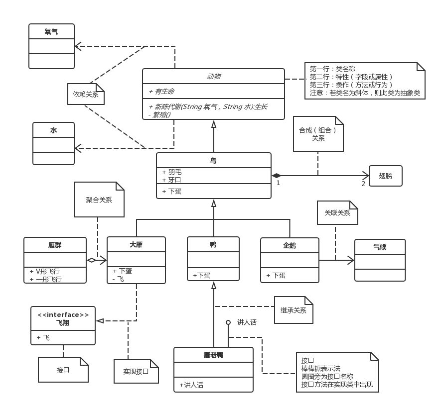
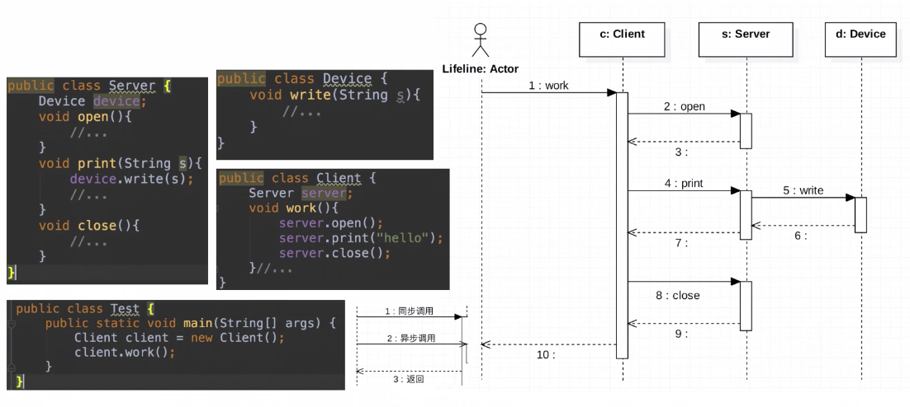

## 设计模式七大原则

- 开闭原则
- 依赖倒置原则
- 单一职责原则
- 接口隔离原则
- 迪米特法则
- 里氏替换原则
- 合成复用原则

### 开闭原则
一个软件实体如类、模块和函数应该对扩展开放，对修改关闭。
模块应尽量在不修改原代码的情况下进行扩展。

### 依赖倒置原则
程序要依赖于抽象接口，不要依赖于具体实现。
简单的说就是要求对抽象进行编程，不要对实现进行编程，
这样就降低了客户与实现模块间的耦合。

### 单一职责原则
一个类或者模块应该有且只有一个改变的原因。
简单来说就是一个类应该只负责一个职责。

### 接口隔离原则
客户端不应该依赖它不需要的接口，类间的依赖关系应该建立在最小的接口上。
简单来说就是建立单一的接口，不要建立臃肿庞大的接口。
也就是接口尽量细化，同时接口中的方法尽量少。

### 迪米特法则
迪米特法则也叫做最少知识原则。
一个软件实体应当尽可能的少与其他实体发生相互作用。
每一个软件单位对其他软件单位都只有最少的知识，而且局限于那些与本单位密切相关的软件单位。
迪米特法则的初衷在于降低类之间的耦合。

### 里氏替换原则
里氏代换原则是面向对象设计的基本原则之一。
所有引用基类的地方都能透明地替换为子类对象。
可以在定义时尽量使用基类对象，等到运行时再确定其子类类型，
用子类对象来替换父类对象。

### 合成复用原则
合成/聚合复用原则经常又叫做合成复用原则。
定义为尽量使用合成/聚合，而不是通过继承达到复用的目的。

## 设计模式

GoF提出了23种设计模式，按照目的分为三类

这里将简单工厂模式作为补充

创建型：
[单例模式](pattern/src/creational/singleton/readme.md)、
[简单工厂模式](pattern/src/creational/simplefactory/readme.md)、
[工厂方法模式](pattern/src/creational/factorymethod/readme.md)、
[抽象工厂模式](pattern/src/creational/abstractfactory/readme.md)、
[建造者模式](pattern/src/creational/builder/readme.md)、
原型模式

结构型：
[外观模式](pattern/src/structural/facade/readme.md)、
[装饰者模式](pattern/src/structural/decorator/readme.md)、
[适配器模式](pattern/src/structural/adapter/readme.md)、
[享元模式](pattern/src/structural/flyweight/readme.md)、
组合模式、桥接模式、
[代理模式](pattern/src/structural/proxy/readme.md)

行为型：
[模板方法模式](pattern/src/behavioral/templatemethod/readme.md)、
迭代器模式、
[策略模式](pattern/src/behavioral/strategy/readme.md)、
解释器模式、
[观察者模式](pattern/src/behavioral/observer/readme.md)、
备忘录模式、
命令模式、中介者模式、责任链模式、访问者模式、状态模式

### 常用设计模式
常用设计模式有12种，一定要掌握好

[单例模式](pattern/src/creational/singleton/readme.md)、
[简单工厂模式](pattern/src/creational/simplefactory/readme.md)、
[工厂方法模式](pattern/src/creational/factorymethod/readme.md)、
[建造者模式](pattern/src/creational/builder/readme.md)、
[外观模式](pattern/src/structural/facade/readme.md)、
[装饰者模式](pattern/src/structural/decorator/readme.md)、
[适配器模式](pattern/src/structural/adapter/readme.md)、
[享元模式](pattern/src/structural/flyweight/readme.md)、
[代理模式](pattern/src/structural/proxy/readme.md)、
[模板方法模式](pattern/src/behavioral/templatemethod/readme.md)、
[策略模式](pattern/src/behavioral/strategy/readme.md)、
[观察者模式](pattern/src/behavioral/observer/readme.md)

## UML类图和时序图

### UML类图

大话设计模式uml类图：

UML类图符号：

符号 | 说明 |
---|---
+ | public
- | private
# | protected
~ | default
下面有横线 | static
字体是斜体 | abstract

### UML时序图
简单的时序图，从网上找的，不知道出自谁了

