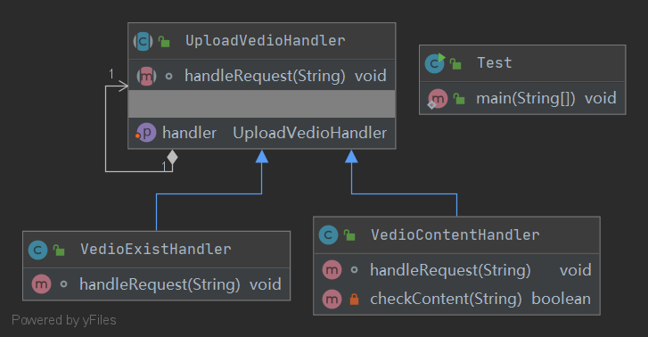

## Chain of Responsibility 责任链模式

定义：
- 为了避免请求发送者与多个请求处理者耦合在一起，
将所有请求的处理者通过前一对象记住其下一个对象的引用而连成一条链。
当有请求发生时，可将请求沿着这条链传递，直到有对象处理它为止。

角色：
- 抽象处理者
- 具体处理者
- 客户类

uml类图：

使用场景：
- 一个请求的处理需要多个对象当中的一个或者多个进行处理

优点：
- 将请求的发送者和请求的处理者进行解耦

缺点：
- 责任链太长，可能会导致处理时间太长，影响性能
