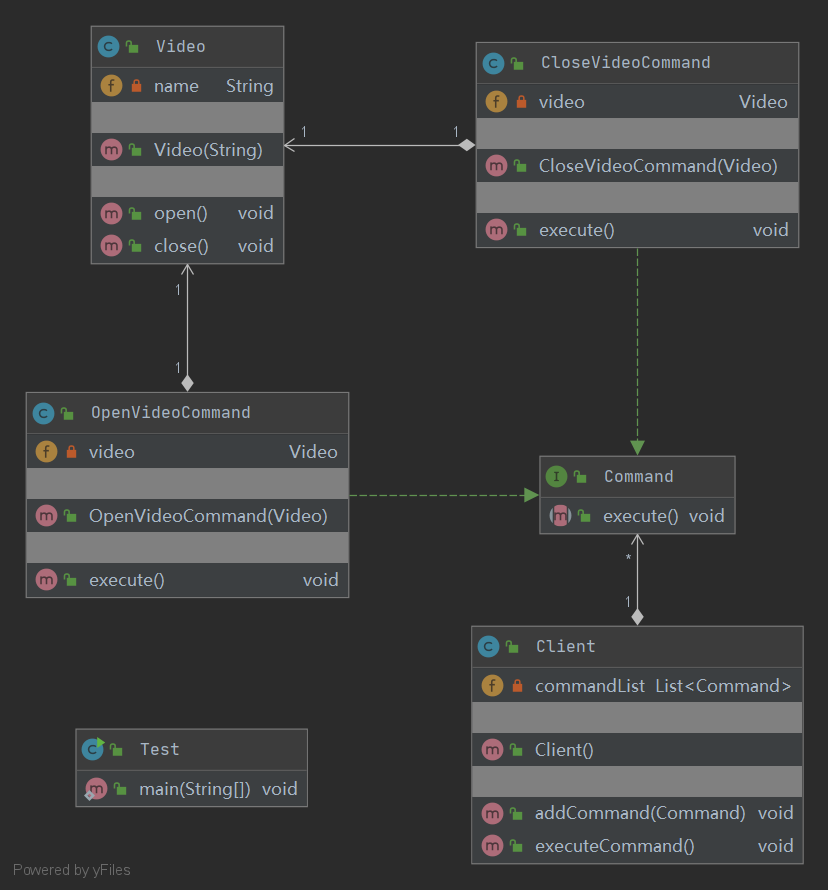

## Command 命令模式

定义：
- 将一个请求封装为一个对象，使发出请求的职责和执行请求的职责分割开

角色：
- 抽象命令类
- 具体命令类
- 接收者
- 调用者

uml类图：

使用场景：
- 当系统需要将请求调用者与请求接收者解耦时，命令模式使得调用者和接收者不直接交互
- 当系统需要随机请求命令或经常增加或删除命令时，命令模式比较方便实现这些功能

优点：
- 将命令的请求者和命令的执行者解耦
- 方便扩展新的命令

缺点：
- 命令的扩展使类的数量增多，增加了系统的复杂度
