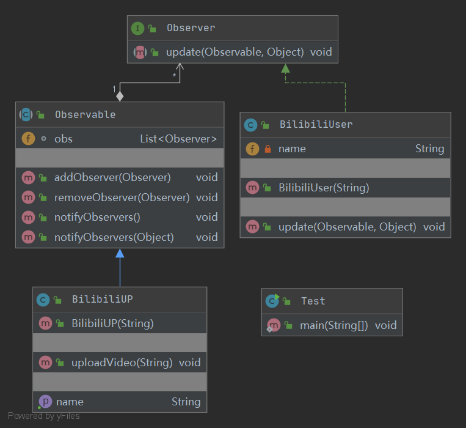

## Observer 观察者模式

定义：
- 多个对象间存在一对多的依赖关系，
当一个对象的状态发生改变时，所有依赖于它的对象都得到通知并被自动更新

角色：
- 抽象被观察者
- 具体被观察者
- 抽象观察者
- 具体观察者

uml类图：

使用场景：
- 关联行为场景，建立一套触发机制

优点：
- 被观察者和观察者之间建立一个抽象的耦合
- 便于扩展

缺点：
- 观察者之间有过多细节依赖，提高时间消耗
