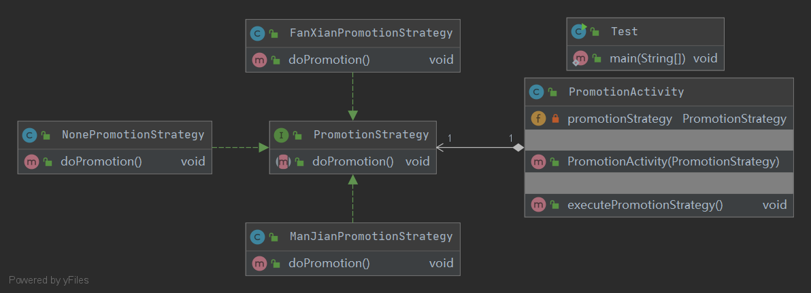

## Strategy 策略模式

定义：
- 定义一些列算法，将每个算法都封装起来，使它们之间可以互相替换，
并且算法的变化不会影响使用算法的客户

角色：
- 上下文类
- 抽象策略类
- 具体策略类

uml类图：

使用场景：
- 一个系统需要动态的在几种算法中选择一种
- 替代有大量if else的场景

优点：
- 避免使用多重条件判断语句
- 隐藏算法的实现细节，增加安全性
- 符合开闭原则

缺点：
- 会产生大量类
- 客户端会知道所有策略类，不符合迪米特法则

补充：
- 策略模式通常会和其他模式搭配使用
- 例如当与简单工厂模式一起使用时，可以隐藏策略选择的细节，符合迪米特法则（详情见代码）