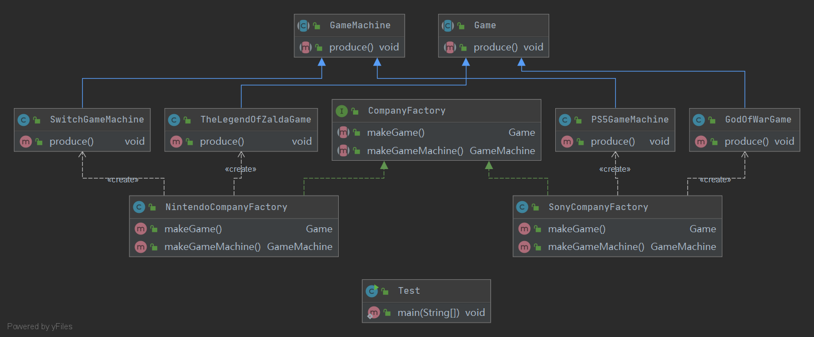

## Abstract Factory 抽象工厂模式

定义：
- 抽象工厂模式提供一个创建一系列相关或相互依赖对象的接口

角色：
- 抽象工厂类
- 具体工厂类
- 抽象产品类
- 具体产品类

uml类图:

使用场景：
- 一系列相关产品对象（属于同一产品族）一起创建使用时，需要大量重复代码

优点：
- 无需知道创建细节，就可以创建出所需对象
- 将一个系列的产品族一起创建
- 增加新的产品族时符合开闭原则

缺点：
- 在产品族中增加新的产品时困难
- 类的数量过多，增加了复杂度
- 增加新的产品（产品的等级结构）时不符合开闭原则
