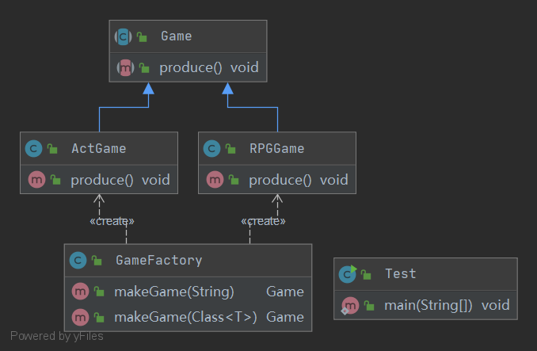

## Simple Factory 简单工厂模式

定义：
- 由一个工厂决定创建出哪一种产品实例

角色：
- 工厂类
- 抽象产品类
- 具体产品类

uml类图:

使用场景：
- 因为需要知道所有产品类，所以适用于创建对象比较少的情况

优点：
- 无需知道创建细节，就可以创建出所需对象

缺点：
- 增加新产品时需要修改工厂类，不符合开闭原则

补充：
- 当使用反射创建对象时可以规避对工厂类的修改
