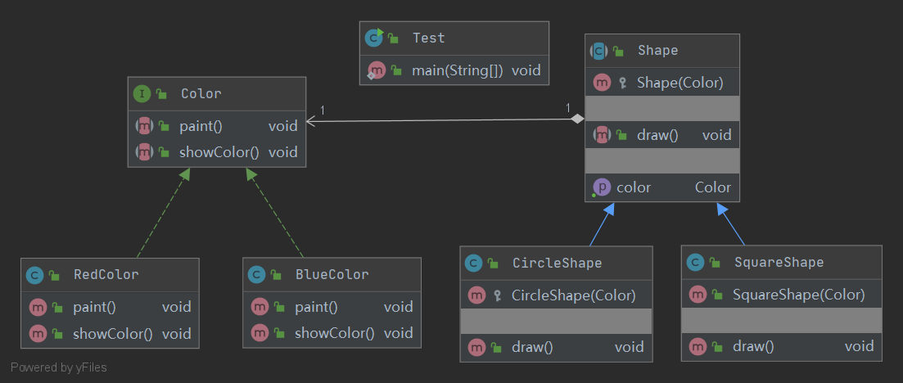

## Bridge 桥接模式

定义：
- 将抽象与实现分离，使它们可以独立变化。
它是用组合关系代替继承关系来实现，
从而降低了抽象和实现这两个可变维度的耦合度。

角色：
- 抽象化类
- 具体抽象化类
- 实现化类
- 具体实现化类

uml类图：

使用场景：
- 当一个类存在两个独立变化的维度，且这两个维度都需要进行扩展时。
- 当一个系统不希望使用继承或因为多层次继承导致系统类的个数急剧增加时。
- 当一个系统需要在构件的抽象化角色和具体化角色之间增加更多的灵活性时。

优点：
- 分离了抽象部分和具体部分
- 符合开闭原则
- 符合合成复用原则

缺点：
- 增加系统的理解与设计难度