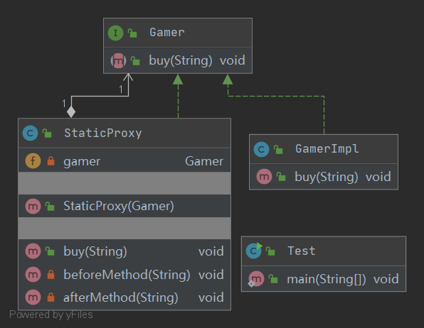

## Proxy 代理模式

定义：
- 为其它对象提供一种代理，以控制这个对象的访问，
代理对象在客户端和目标对象之间起到中介作用

角色：
- 抽象主题类
- 真实主题类
- 代理类

uml类图：

使用场景：
- 保护目标对象
- 增强目标对象

优点：
- 降低了系统耦合度，提高可扩展性

缺点：
- 使用静态代理需要为每一个服务都创建代理类，类数量增多
- 动态代理仅支持interface代理